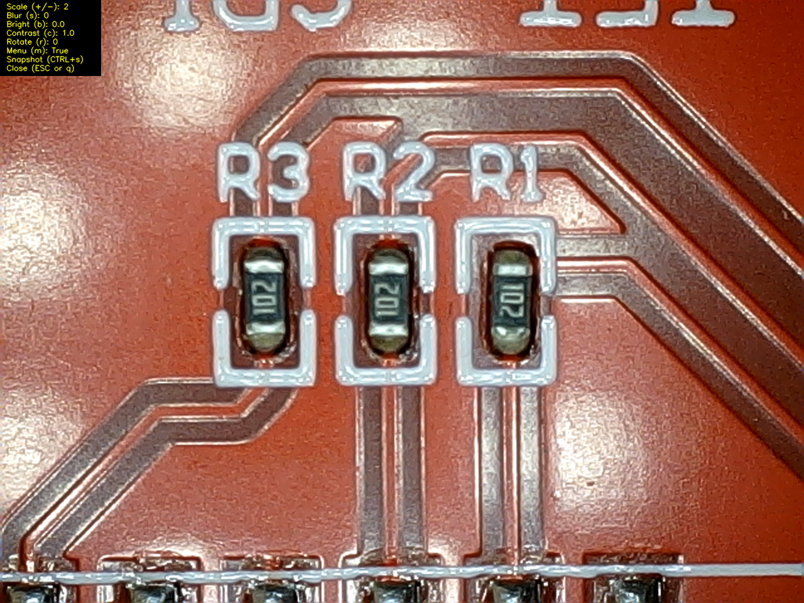

# About
This is a Python script for an DNT USB microscope camera. This microscope was sold a 5 MPix years ago, but delivers only a 640x480 25fps stream. I didn't like the feeling of the original software, so i did my own.

I'm using Python-3.12.0 with OpenCV on Windows. It **should** work with other similar cameras and Linux as well.
This program, and associated information is Open Source (see Licence).

# Screenshot
The Image below is a screenshot, taken with **CTRL+s** from the current video stream.
It shows three 0603 resistors. As a reference, each resistor is 1.60mm x 0.80 mm.

If you don't want the menu in the screenshot, turn it off before using key **m**.

There's nearly no delay between the camera and the video, this improves the usability a lot. And, if you ever used such device, you will love the rotation feature just entering an **r**.

## Features
- Image scaling using Bicubic interpolation.
- Blur image smoothing (default = off)
- Fullscreen / Windowed mode
- Image rotation in 90deg steps
- Variable Contrast
- Variable Brightness
- Snapshot images
- On Screen menu (default = on), can be turned off

## Dependencies
- Python 3
- OpenCV with v4l (Linux) or MSMF (Windows) or FFMPEG video capture.

NOTE: the version included in mingw64 doesnt include all video capture devices (for example MSMF is missing).

## Running the Program
Run **USB-microscope.py**.

It uses the default camera device, you may need to change it, if more than one video device is available.
If needed, change the line

*dev = 0*

## Compiling the program into an exe (Windows)

Open a command window, change to the directory, where USB-microscope.py is located and run

**pyinstaller -F USB-microscope.py**

If the command is not yet installed, you may install need to install it first:

**py -m pip install pyinstaller**

## Using the program
- **ESC** or **q** - end program 
- **+** or **-** - change window size and scale up/down
- **s** - smooth image
- **b** - toggle trough brightness values
- **c** - toggle trough contrast values
- **r** - rotate clockwise in 90deg steps
- **m** - toggle menu
- **CTRL + s** - save snapshot as png

## A last comment ##
This a fast and quick one-day shot. I'm not going to spend too much time for this.
But, if you have some really good idea for improvement, let me know..

Have phun,
Winfried
